<div align="center">

# Rishu Ranjan
### Senior Application Security Engineer · OSCP · CREST CPSA · CRT


<p>
  <a href="https://www.linkedin.com/in/rishuranjan">
    
  </a>
  <a href="https://twitter.com/secureit_rrj">
    
  </a>
  <a href="mailto:rishuranjanofficial@gmail.com">
    
  </a>
  <a href="https://github.com/rishuranjanofficial">
    
  </a>
</p>

</div>

---

## About Me

OSCP-certified Application Security Engineer with **10 years** of experience securing fintech, SaaS, and cloud platforms at scale. I lead Application Security, Secure Code Review, API Security Testing, AWS Cloud Security, and Vulnerability Management programs - currently at **PAR Technology**.

- 🔭 Currently implementing SAST/SCA practices (Snyk) and leading SAST, DAST, and network VAPT across multi-tenant cloud environments
- 🧠 Evaluating **Meta's Llama Guard** for enterprise content moderation and AI safety initiatives
- 🤖 Engineering custom **AI agents** (Glean, Copilot) to automate high-velocity security document review and multi-year trend analysis
- ☁️ Auditing Amazon ECR container images for vulnerabilities and zero-trust compliance; running PCI DSS v4.0 assessments
- 🌱 Core Contributor to the **OWASP Web Security Testing Guide (WSTG)** since 2020
- 🐛 Independent bug bounty researcher on **HackerOne** and **Bugcrowd**
- 🏆 Security acknowledgements from **Apple, Microsoft, SAP, LG Electronics, and Google**
- 📜 CVE Author - CVE-2018-12234, 12650, 12651, 12652, 12653
- 💬 Ask me about: Application Security, Secure Code Review, AWS Security, AI/LLM Security, Vulnerability Management

---

## Experience

```text
2025 – Present   Senior Application Security Engineer          PAR Technology
2023 – 2025      Security Lead (Fintech)                       Paytm
2021 – 2023      Senior Security Engineer                      Paytm
2016 – 2021      Senior Security Analyst                       Lucideus Technologies
```

**PAR Technology** - Implementing SAST/SCA (Snyk), leading SAST/DAST/network VAPT across multi-tenant cloud environments, evaluating Llama Guard for AI safety, engineering AI agents for security document review, auditing Amazon ECR images, running PCI DSS v4.0 assessments, and embedding guardrails across CI/CD pipelines.

**Paytm (Security Lead, Fintech)** - Led Vulnerability Management (Qualys) for a high-traffic fintech platform, directing risk analysis, prioritization, and remediation across banking infrastructure; managed a team of 6 security engineers; ran CWPP cloud posture reviews and RBI-mandated CA/CR hardening.

**Paytm (Senior Security Engineer)** - Ran SAST, DAST, and network VAPT; led Qualys-based vulnerability management and RBI compliance audits; built Python/Bash automation for triage and asset discovery, cutting manual effort by 40%.

**Lucideus Technologies** - Led Red Team assessments and source code reviews for Fortune 500 clients, delivering VAPT for 100+ applications across web, API, and mobile.

---

## Technical Skills

<div align="center">


</div>

**Focus areas:** Application Security & Secure Code Review · AI Security & Agent Engineering · Cloud Security (AWS) · SAST & SCA · API Security Testing · Vulnerability Management

---

## Certifications & Research

| | |
|---|---|
| 🎓 **Certifications** | OSCP · CREST CPSA · CREST CRT |
| 🧩 **OWASP** | Core Contributor, Web Security Testing Guide (WSTG) - 2020–Present |
| 🏅 **Acknowledged by** | Apple · Microsoft · SAP · LG Electronics · Google (2018–2023) |
| 📄 **CVEs** | CVE-2018-12234, 12650, 12651, 12652, 12653 |
| 🎓 **Education** | M.Sc. Informatics, University of Delhi (2014–2016) · B.Sc(H) Electronics, University of Delhi - ARSD College (2011–2014) |

---

## GitHub Stats

<div align="center">




</div>

<div align="center">


</div>

---

<div align="center">
📫 **Reach me:** rishuranjanofficial@gmail.com &nbsp;|&nbsp; 📍 New Delhi, India
</div>
